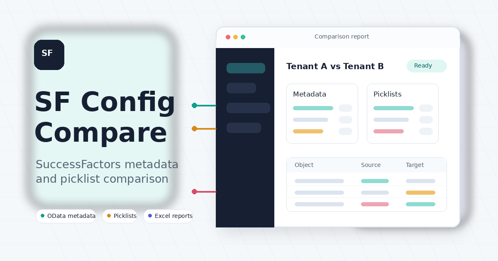

# SF Config Compare

[](https://sahirvhora.github.io/sf-config-compare/)
[](https://www.python.org/)

SF Config Compare is a small Flask app for comparing SAP SuccessFactors
configuration across two instances. It pulls OData metadata and picklist values
from each instance, stores the latest pulls in a local SQLite database, and
generates side-by-side HTML and Excel comparison reports.

Public project page: https://sahirvhora.github.io/sf-config-compare/



## What It Compares

- OData entities present in one instance but missing in another
- Field-level metadata differences, including type, required flag, visibility,
  max length, picklist assignment, and custom-field flag
- Picklists present in one instance but missing in another
- Picklist values missing from shared picklists
- Picklist value differences, including English label, status, and locale labels

## Setup

```bash
git clone https://github.com/SahirVhora/sf-config-compare.git
cd sf-config-compare
python3 -m venv .venv
. .venv/bin/activate
pip install -r requirements.txt
cp .env.example .env
# edit .env and set FLASK_SECRET_KEY
flask run --port 5050
```

Open http://localhost:5050.

## Basic Workflow

1. Add two or more SuccessFactors instances.
2. Run **OData Metadata** for each instance.
3. Run **Picklist** for each instance.
4. Open **Compare**, choose Instance A and Instance B, and run the comparison.
5. Review the generated HTML report or download the Excel report.

## SuccessFactors Access Required

The SF technical user needs API access to:

- `/odata/v2/$metadata`
- `/odata/v2/PickListValueV2`

The app supports basic authentication and OAuth 2.0 client credentials. Secrets
are stored using the OS keyring when available, with a local `.secrets.json`
fallback for headless/dev systems. Do not commit `.env`, `.secrets.json`, local
databases, logs, or generated reports.

## Local Data

Runtime data is stored locally and ignored by git:

- `db/vault.db`
- `reports/`
- `logs/`
- `.secrets.json`

## Development

```bash
pip install -r requirements-dev.txt
pytest -q
python3 -m compileall app.py core
```

## Deployment Notes

The repository includes:

- `index.html`, `robots.txt`, `sitemap.xml`, and `assets/social-preview.png` for
  the public GitHub Pages site.
- `.github/workflows/pages.yml` for GitHub Pages deployment from `main`.
- `Procfile` and `render.yaml` for Python web hosts such as Render.

The public site is safe to publish. The Flask application itself should be
hosted only behind suitable authentication and network controls before adding
real tenant credentials or pulling configuration data.
