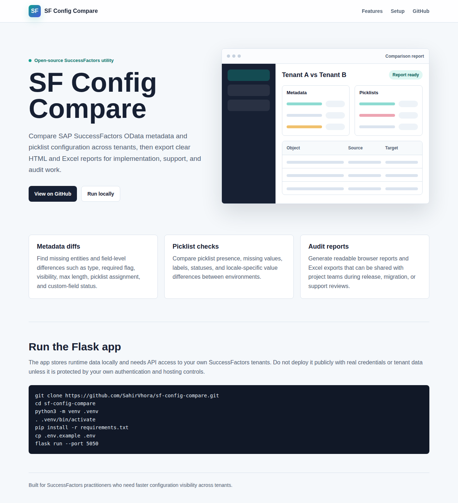

# SF Config Compare

[](https://sahirvhora.github.io/sf-config-compare/)
[](https://www.python.org/)
[](LICENSE)

SF Config Compare is a Flask app for comparing SAP SuccessFactors configuration
across two or more instances. It pulls OData metadata and picklist values from
each instance, stores the latest pulls in a local SQLite database, and generates
side-by-side HTML and Excel comparison reports.

Public project page: https://sahirvhora.github.io/sf-config-compare/



## What It Compares

- OData entities present in one instance but missing in another
- Field-level metadata differences, including type, required flag, visibility,
  max length, picklist assignment, and custom-field flag
- Picklists present in one instance but missing in another
- Picklist values missing from shared picklists
- Picklist value differences, including English label, status, and locale labels

### Two-Instance Compare vs N-Instance Matrix

| Mode | When to use |
|------|-------------|
| **Compare** (2 instances) | Side-by-side diff of Instance A vs B. Highlights what is only in A, only in B, or differs. |
| **Matrix** (N instances) | All instances in one view - DEV / STAGING / UAT / PROD side-by-side. Each cell shows the value per instance; amber = differs, green = uniform, red = missing. |

### Selective Picklist Comparison

When running a comparison, you can choose which picklist fields to compare:

- **English label** (`label_en`) - compares the English display name
- **Status** - compares active/inactive status
- **Locale labels** (e.g. `locale:en_US`) - compares locale-specific overrides

Unchecking fields you don't need speeds up the comparison and produces a
cleaner report. By default all three options are enabled.

## Setup

### Local (Flask)

```bash
git clone https://github.com/SahirVhora/sf-config-compare.git
cd sf-config-compare
python3 -m venv .venv
. .venv/bin/activate
pip install -r requirements.txt
cp .env.example .env
# edit .env and set SECRET_KEY (run the command shown in .env.example)
flask run --port 5050
```

Open http://localhost:5050.

### Docker (optional)

```bash
docker build -t sf-config-compare .
docker run -p 5050:5050 \
  -e SECRET_KEY=your-secret-key-here \
  sf-config-compare
```

A `Dockerfile` is included in the repository for containerised deployments.

### Render

The repository includes a `render.yaml` that configures a free-tier Python web
service. Connect your GitHub repo to Render and it picks up the settings
automatically.

## Basic Workflow

1. Add two or more SuccessFactors instances.
2. Run **OData Metadata** for each instance.
3. Run **Picklist** for each instance.
4. Choose a comparison mode:
   - **Compare** - choose Instance A and Instance B, optionally narrow the
     picklist scope, and run the comparison.
   - **Matrix** - select 2-10 instances, and run the matrix comparison to see
     all instances side-by-side in one report.
5. Review the generated HTML report or download the Excel report.
6. Use the **Test Connection** button on the instance form to verify
   credentials before pulling data.

### Matrix Comparison

The Matrix view compares N instances simultaneously. Select multiple instances
using Ctrl/Cmd-click on the instance list, then click **Run Matrix Comparison**.

The generated report has three tabs:

| Tab | Contents |
|-----|---------|
| **Field Diffs** | Only fields that differ across instances. Each column is one instance; amber = differs, red = absent. |
| **Entity Coverage** | Which entities are present or missing per instance. |
| **Picklist Diffs** | Picklist values that differ in label or status across instances. |

The Excel export adds two additional sheets: **Field All** (every field including
uniform ones) and **Picklist Diffs**.

## SuccessFactors Access Required

The SF technical user needs API access to:

- `/odata/v2/$metadata`
- `/odata/v2/PickListValueV2`

The app supports basic authentication and OAuth 2.0 client credentials. Secrets
are stored using the OS keyring when available, with a local `.secrets.json`
fallback for headless/dev systems. Do not commit `.env`, `.secrets.json`, local
databases, logs, or generated reports.

## Report Access Control

If you set `REPORT_ACCESS_TOKEN` in your `.env`, the report view and download
endpoints require a matching `?token=` query parameter. This prevents
unauthorised access when the app is exposed on a network.

## REST API

All comparison features are also available via a JSON API at `/api/v1/`. Useful
for CI/CD pipelines, Slack bots, or any tooling that needs machine-readable drift
results.

### Two-instance comparison

```bash
POST /api/v1/compare
Content-Type: application/json

{
  "instance_a_id": 1,
  "instance_b_id": 2,
  "picklist_fields": ["label_en", "status"],
  "entity_filter": ["JobInfo"]
}
```

### N-instance matrix comparison

```bash
POST /api/v1/matrix
Content-Type: application/json

{
  "instance_ids": [1, 2, 3, 4],
  "picklist_fields": ["label_en", "status"],
  "entity_filter": [],
  "include_reports": true
}
```

Setting `include_reports: true` generates the Excel + HTML report files and
returns a `report_id` in the response. The report is then accessible at
`/reports/<report_id>/view`.

Other endpoints: `GET /api/v1/instances`, `POST /api/v1/compare/report`,
`GET /api/v1/reports/<id>/download`, `GET /api/v1/health`.

## Known Limitations

- Compares **OData v2 metadata** and **PickListValueV2** only. MDF objects,
  Foundation Objects, Business Rules, associations, and other configuration
  areas are not compared.
- The app does **not** sync or write back to any instance - read-only.
- Concurrent pulls are limited to 3 at a time (semaphore). Running multiple
  gunicorn workers will break the in-memory pull status tracking; the app is
  designed for `workers=1`.
- Report HTML is capped at 500 picklist rows per section. Download the Excel
  export for the full dataset.
- Pull history is preserved per instance (entity and picklist snapshots per
  pull), viewable via the instance history page and `/api/v1/instances/<id>/history`.

## Local Data

Runtime data is stored locally and ignored by git:

- `db/vault.db`
- `reports/`
- `logs/`
- `.secrets.json`

## Development

```bash
pip install -r requirements-dev.txt
pytest -q
python3 -m compileall app.py core
```

## Deployment Notes

The repository includes:

- `index.html`, `robots.txt`, `sitemap.xml`, and `assets/` for the public
  GitHub Pages site.
- `.github/workflows/pages.yml` for GitHub Pages deployment from `main`.
- `Procfile` and `render.yaml` for Python web hosts such as Render.

The public site is safe to publish. The Flask application itself should be
hosted only behind suitable authentication and network controls before adding
real tenant credentials or pulling configuration data.

---

## Part of the SF Compass Suite

One of 10 free, open tools for SAP SuccessFactors consultants. Explore the full suite at [SF Compass](https://sahirvhora.github.io/sf-compass/).

Related tools:

- [ObjectSync](https://github.com/SahirVhora/sf-object-sync) - Sync OM foundation objects PRD to Dev
- [Config Debt Radar](https://github.com/SahirVhora/sf-config-debt-radar) - Scan EC configuration debt - CLI, dashboard, MCP server
- [Position Integrity Checker](https://github.com/SahirVhora/sf-position-integrity-checker) - Validate position data integrity
